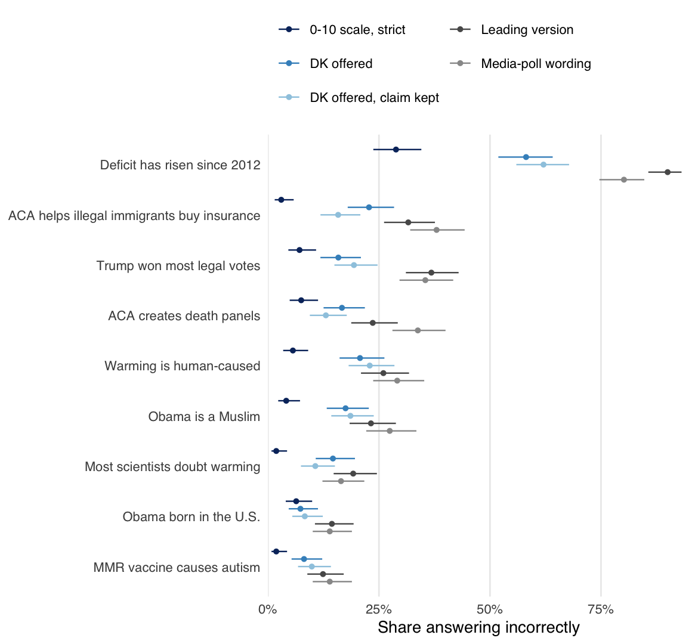

## Misinformation about Misinformation? Of Headlines and Survey Design

Robert C. Luskin, Gaurav Sood, Yul Min Park, and Joshua Blank

By some accounts, the American public is awash in misinformation. Yet the
survey items behind the headlines are often phrased as matters of opinion,
rarely offer an explicit "don't know," and so invite guessing. We code the
design features of media-poll misinformation items and use a survey experiment
to estimate what those features do to estimates of misinformation.

<p align="center">
  
</p>

### Repository

| Path | Contents |
|---|---|
| `data/raw/` | The media-poll corpus, Roper toplines, and the survey experiment; see [data/README.md](data/README.md) |
| `docs/` | Item-level decisions, answer keys, the questionnaire, and how each citation was checked |
| `R/` | Scoring the corpus (`corpus.R`), the experiment (`experiment.R`), figure style, table output |
| `scripts/` | `run_all.R` writes `tabs/*.csv`; `figures.R` writes `figs/`; `tables.R` writes LaTeX tables and number macros |
| `ms/` | `main.tex`, `references.bib`, and the compiled `main.pdf` |
| `tests/testthat/` | Reproductions of the 2018 draft's numbers, tests of the answer keys, and a check that the survey data carry no direct identifiers |

### Running it

```
make restore   # install the package versions in renv.lock
make check     # analysis, figures, tables, manuscript, lint, tests
```

The companion paper, [The Waters of Casablanca](https://github.com/soodoku/waters-of-casablanca),
develops the concept of misinformation and the 0-10 measure used here as a benchmark.
