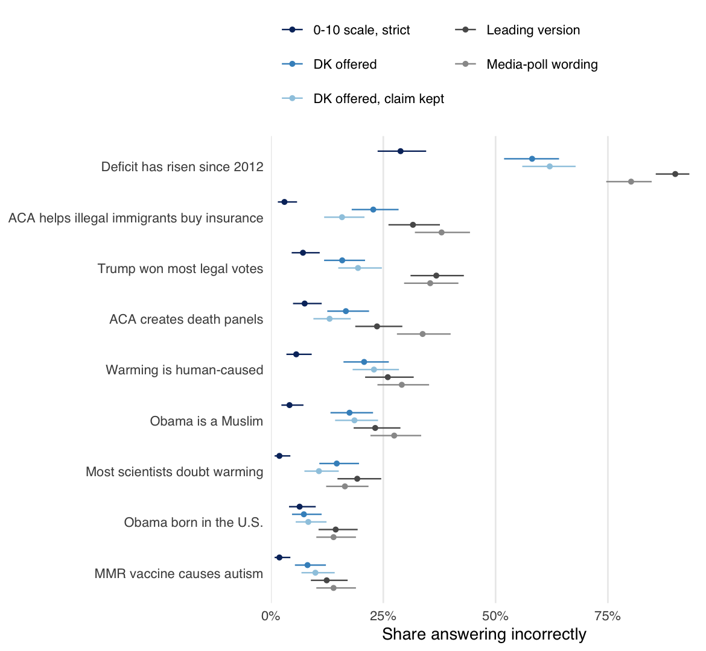

## Misinformation about Misinformation? Of Headlines and Survey Design

Robert C. Luskin, Gaurav Sood, Yul Min Park, and Joshua Blank

By some accounts, the American public is awash in misinformation. Yet the
survey items behind the headlines are often phrased as matters of opinion,
rarely offer an explicit "don't know," and so invite guessing. We code the
design features of media-poll misinformation items and use a survey experiment
to estimate what those features do to estimates of misinformation.

<p align="center">
  
</p>

### Repository

| Path | Contents |
|---|---|
| `data/raw/` | The media-poll corpus, Roper toplines, and the survey experiment; see [data/README.md](data/README.md) |
| `docs/` | Item-level decisions, answer keys, the questionnaire, and how each citation was checked |
| `R/` | Reusable functions: source validation, corpus scoring, experimental estimates, and output writers. These files do not run the analysis. |
| `scripts/` | Configuration and numbered execution stages, listed below. |
| `data/derived/` | Generated intermediate data; ignored by Git. |
| `ms/` | `main.tex`, `references.bib`, and the compiled `main.pdf` |
| `tests/testthat/` | Reproductions of the 2018 draft's numbers, tests of the answer keys, and a check that the survey data carry no direct identifiers |

### Running it

```
make restore
make check
```

`make restore` installs the package versions in `renv.lock`. `make check` rebuilds the analysis and manuscript, lints the R code, and runs the tests. R 4.6 and XeLaTeX with `latexmk` are required. `make ci-docker` runs these checks in the project's standard Rocker image.

### Script organization

`make analysis` runs `scripts/99_run_all.R`. It loads the configuration and reusable functions in `R/`, then executes stages 01–04 in separate environments. Stages pass results through files.

| File | Purpose |
|---|---|
| `scripts/00_config.R` | Paths, source hashes, labels, colors, `theme_paper()`, figure sizes, and `table_style`. |
| `scripts/01_prepare_data.R` | Verify source hashes, read and score the inputs, and save `data/derived/prepared_data.rds`. |
| `scripts/02_estimate.R` | Read the prepared data and write estimates to `tabs/*.csv`. |
| `scripts/03_figures.R` | Read the estimates and write PDF and PNG figures to `figs/`. |
| `scripts/04_tables.R` | Generate LaTeX tables, manuscript numbers, and `tabs/style.tex`. |
| `scripts/99_run_all.R` | Run all stages in order. |

Change plot and table defaults in `00_config.R`. The manuscript applies the generated `\TableStyle` to each table. Statistical and coding functions stay in `R/corpus.R` and `R/experiment.R`, where tests can call them without running the pipeline.

The companion paper, [The Waters of Casablanca](https://github.com/finite-sample/know_casablanca),
develops the concept of misinformation and the 0-10 measure used here as a benchmark.
